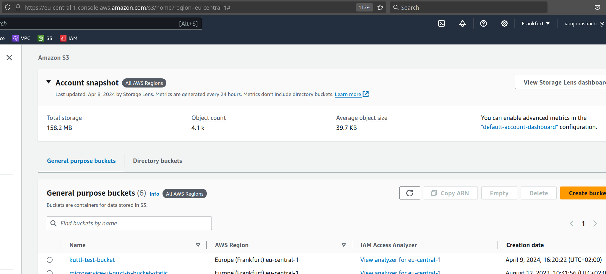

# crossplane-kuttl
[](https://github.com/jonashackt/crossplane-kuttl/actions/workflows/kuttl-crossplane-aws.yml)
[](https://github.com/jonashackt/crossplane-kuttl/blob/master/LICENSE)
[](https://renovatebot.com)

Example project showing how to use KUTTL to create e2e integration tests with Crossplane 

Why I didn't choose to use [uptest](https://github.com/crossplane/uptest):

> __WARNING:__ uptest is a work in progress and hardly ever used by any other than Upbound staff themselves. See [this issue comment](https://github.com/upbound/official-providers-ci/issues/153#issuecomment-1756317685): "I think we have to be honest and document somewhere that currently uptest is not really usable without surrounding make targets and the build module :)"

Therefore in this repository I went with native kuttl instead for the meantime. 

__TLDR;__ run:

```shell
# Create aws-creds.conf for Crossplane to access AWS
echo "[default]
aws_access_key_id = $(aws configure get aws_access_key_id)
aws_secret_access_key = $(aws configure get aws_secret_access_key)
" > aws-creds.conf

# Run kuttl tests
kubectl kuttl test
```

To run multiple tests, you don't need to setup kind and Crossplane incl. it's Providers every time simply run:

```shell
# Only once:
kubectl kuttl test --skip-cluster-delete
# and the following runs:
kubectl kuttl test --start-kind=false
```


# The KUbernetes Test TooL (kuttl) 

https://kuttl.dev/docs/kuttl-test-harness.html

> "KUTTL is a declarative integration testing harness for testing operators, KUDO, Helm charts, and any other Kubernetes applications or controllers. Test cases are written as plain Kubernetes resources and can be run against a mocked control plane, locally in kind, or any other Kubernetes cluster."

So kuttl reminds me of Molecule for Ansible: A test harness for any Kubernetes application. It sounds like a great fit for Crossplane!


### Prerequisites

Be sure to have `kubectl`, `helm` & `kind` installed.


### Install kind

Getting started with kuttl, we want to either use a pre-existing environment. Or start from scratch using kind:

> If you already have a cluster there are no prerequisites. If you want to use the mocked control plane or Kind, you will need Kind (opens new window).

```shell
# fire up kind
kind create cluster --image kindest/node:v1.29.2 --wait 5m
```

> When running with no defined test environment, the default is a preconfigured cluster defined in `$KUBECONFIG`.


### Install kuttl kubectl plugin

https://kuttl.dev/docs/cli.html 

```shell
# On a Mac
brew tap kudobuilder/tap
brew install kuttl-cli
```

One of the best ways to install a kubectl plugin is to use the package manager [krew](https://github.com/kubernetes-sigs/krew). So first install krew via your preferred package manager (see https://krew.sigs.k8s.io/docs/user-guide/setup/install/):

```shell
# Manjaro Linux
pamac install krew
```
> If that gives an error like `go: module cache not found: neither GOMODCACHE nor GOPATH is set`, try without sudo.

Now install kuttl via krew:

```shell
$ kubectl krew install kuttl

WARNING: To be able to run kubectl plugins, you need to add
the following to your ~/.zshrc:

    export PATH="${KREW_ROOT:-$HOME/.krew}/bin:$PATH"

and restart your shell.
```

Add the `export ...` statement to your shell configuration as mentioned in the install statement.

Now testdrive kuttl:

```shell
$ kubectl kuttl --version
kubectl-kuttl version 0.15.0
```


### kuttl building blocks

[kuttl defines the following building blocks](https://kuttl.dev/docs/kuttl-test-harness.html#writing-your-first-test):

* A "test suite" (aka `TestSuite`) is comprised of many test cases that are run in parallel. 
* A "test case" is a collection of test steps that are run serially - if any test step fails then the entire test case is considered failed.
* A "test step" (aka `TestStep`) defines a set of Kubernetes manifests to apply and a state to assert on (wait for or expect).


### Create a kuttl test suite

https://kuttl.dev/docs/cli.html#examples

First we create a folder `tests/e2e` where the `e2e` is the name of our test suite:

```shell
mkdir -p tests/e2e
```

Now in the root of our project we need to create a [`kuttl-test.yaml`](kuttl-test.yaml) defining our `TestSuite`:

```yaml
apiVersion: kuttl.dev/v1beta1
kind: TestSuite
testDirs:
  - tests/e2e/
startKIND: true
kindContext: crossplane-test
```

Our pre-created directory must be defined in `testDirs`.

Using `startKIND: true` kuttl will start a kind cluster with the name `crossplane-test` defined in `kindContext`.

We should also add the following lines to our `.gitignore` to prevent us from checking in kind logs or `kubeconfig` files:

```shell
kubeconfig
kind-logs-*
```


### Install Crossplane in kuttl TestSuite

To be able to write tests for Crossplane, we need to have it installed in our cluster first.

[kuttl has a `commands` keyword ready](https://kuttl.dev/docs/testing/reference.html#commands) for us in `TestSuite` and `TestStep` objects. Starting with a binary we can execute anything we'd like.

Since we need Crossplane installed and ready for all our tests, we install it in the TestSuite instead of every TestStep.

Inside our [`kuttl-test.yaml`](kuttl-test.yaml) we add `command` statements to install Crossplane into the kind test cluster:

```yaml
apiVersion: kuttl.dev/v1beta1
kind: TestSuite
commands:
  # Install crossplane via Helm Renovate enabled (see https://stackoverflow.com/a/71765472/4964553)
  - command: helm dependency update crossplane/install
  - command: helm upgrade --install crossplane --namespace crossplane-system crossplane/install --create-namespace --wait
testDirs:
  - tests/e2e/
startKIND: true
kindContext: crossplane-test
```

The [installation of Crossplane works "Renovate" enabled via a local Helm Chart](https://stackoverflow.com/a/71765472/4964553) we defined in `crossplane/install` directory:

```yaml
apiVersion: v2
type: application
name: crossplane
version: 0.0.0 # unused
appVersion: 0.0.0 # unused
dependencies:
  - name: crossplane
    repository: https://charts.crossplane.io/stable
    version: 1.15.1
```

Only be sure to add the following to your `.gitignore`:

```shell
# Exclude Helm charts lock and packages
**/**/charts
**/**/Chart.lock
```

Check the installation works via:

```shell
kubectl kuttl test --skip-cluster-delete
```

The `--skip-cluster-delete` flag will preserve our `crossplane-test` kind cluster for later runs.

Thus a `docker ps` should show the cluster also:

```shell
docker ps
CONTAINER ID   IMAGE                  COMMAND                  CREATED         STATUS              PORTS                       NAMES
782fa5bb39a9   kindest/node:v1.25.3   "/usr/local/bin/entr…"   2 minutes ago   Up About a minute   127.0.0.1:34407->6443/tcp   crossplane-test-control-plane
```

You can even connect to the kind cluster directly setting the `KUBECONFIG` env variable like this:

```shell
export KUBECONFIG="/home/jonashackt/dev/crossplane-kuttl/kubeconfig"
```

Now you should be able to access the kuttle created kind cluster in this current shell:

```shell
$ kubectl get nodes
NAME                            STATUS   ROLES           AGE     VERSION
crossplane-test-control-plane   Ready    control-plane   4m25s   v1.25.3
```

To get your normal `kubectx` config working again, simply run `unset KUBECONFIG`.

If you need to delete the cluster later, run:

```shell
kind delete clusters crossplane-test
```


### Install AWS Provider in kuttl TestSuite

The Upbound AWS Provider Family for S3 needed for our objectstorage Composition is located in [`crossplane/provider/upbound-provider-aws-s3.yaml`](crossplane/provider/upbound-provider-aws-s3.yaml):

```yaml
apiVersion: pkg.crossplane.io/v1
kind: Provider
metadata:
  name: upbound-provider-aws-s3
spec:
  package: xpkg.upbound.io/upbound/provider-aws-s3:v1.2.1
  packagePullPolicy: IfNotPresent # Only download the package if it isn’t in the cache.
  revisionActivationPolicy: Automatic # Otherwise our Provider never gets activate & healthy
  revisionHistoryLimit: 1
```

Thus inside our [`kuttl-test.yaml`](kuttl-test.yaml) we add another `command` statements to install the Provider into the kind test cluster & wait for it to become healthy:

```yaml
apiVersion: kuttl.dev/v1beta1
kind: TestSuite
commands:
  # Install crossplane via Helm Renovate enabled (see https://stackoverflow.com/a/71765472/4964553)
  - command: helm dependency update crossplane-install
  - command: helm upgrade --install crossplane --namespace crossplane-system crossplane-install --create-namespace --wait

  # Install the crossplane Upbound AWS S3 Provider Family
  - command: kubectl apply -f crossplane/provider/upbound-provider-aws-s3.yaml
  # Wait until AWS Provider is up and running
  - command: kubectl wait --for=condition=healthy --timeout=180s provider/provider-aws-s3
testDirs:
  - tests/e2e/
startKIND: true
kindContext: crossplane-test
```


### Option a) Configure AWS Provider in kuttl without AWS access (checking Resource rendering only)

It is not always needed to really create resources on AWS through out our tests. It might be enough to just check if the Managed Resources are rendered correctly.

To get the Crossplane AWS Provider to render the Managed Resources without real AWS connectivity, we use the trick [described here](https://aaroneaton.com/walkthroughs/crossplane-package-testing-with-kuttl/) and create a `Secret` without actual AWS creds. You find it in the file [`crossplane/provider/non-access-secret.yaml`](crossplane/provider/non-access-secret.yaml):

```yaml
apiVersion: v1
kind: Secret
metadata:
  name: aws-creds
  namespace: crossplane-system
type: Opaque
stringData:
  key: nocreds
```


Now inside our [`kuttl-test.yaml`](kuttl-test.yaml) we add additional `command` statements to create the Secret and configure the AWS Provider:

```yaml
apiVersion: kuttl.dev/v1beta1
kind: TestSuite
commands:
  # Install crossplane via Helm Renovate enabled (see https://stackoverflow.com/a/71765472/4964553)
  - command: helm dependency update crossplane/install
  - command: helm upgrade --install --force crossplane --namespace crossplane-system crossplane/install --create-namespace --wait

  # Install the crossplane Upbound AWS S3 Provider Family
  - command: kubectl apply -f crossplane/provider/upbound-provider-aws-s3.yaml
  # Wait until AWS Provider is up and running
  - command: kubectl wait --for=condition=healthy --timeout=180s provider/upbound-provider-aws-s3

  # Create AWS Provider secret without AWS access
  - command: kubectl apply -f crossplane/provider/non-access-secret.yaml
  # Create ProviderConfig to consume the Secret containing AWS credentials
  - command: kubectl apply -f crossplane/provider/provider-config-aws.yaml
testDirs:
  - tests/e2e/
startKIND: true
kindContext: crossplane-test
```


The final bit is to configure the AWS Provider via a `ProviderConfig` which is located in [`crossplane/provider/provider-config-aws.yaml`](crossplane/provider/provider-config-aws.yaml):

```yaml
apiVersion: aws.upbound.io/v1beta1
kind: ProviderConfig
metadata:
  name: default
spec:
  credentials:
    source: Secret
    secretRef:
      namespace: crossplane-system
      name: aws-creds
      key: creds
```


Now running `kubectl kuttl test` should run like this preparing everything for testing with Crossplane.


### Option b) Configure AWS Provider in kuttl for real AWS access (checking Rendering & real infrastructure provisioning)

To get this config working, we need to create a `Secret` containing our AWS credentials Crossplane can later use to access AWS. Therefore create an `aws-creds.conf` file ([aws CLI should be installed and configured](https://docs.aws.amazon.com/cli/latest/userguide/getting-started-install.html)):

```shell
echo "[default]
aws_access_key_id = $(aws configure get aws_access_key_id)
aws_secret_access_key = $(aws configure get aws_secret_access_key)
" > aws-creds.conf
```

> __ATTENTION__: Don't check `aws-creds.conf` into version control. The best is to add `aws-creds.conf` to your `.gitignore`.

Now inside our [`kuttl-test.yaml`](kuttl-test.yaml) we add another `command` statements to create the Secret and configure the AWS Provider:

```yaml
apiVersion: kuttl.dev/v1beta1
kind: TestSuite
timeout: 300 # We definitely need a higher timeout for the external AWS resources to become available
commands:
  # Install crossplane via Helm Renovate enabled (see https://stackoverflow.com/a/71765472/4964553)
  - command: helm dependency update crossplane/install
  - command: helm upgrade --install --force crossplane --namespace crossplane-system crossplane/install --create-namespace --wait

  # Install the crossplane Upbound AWS S3 Provider Family
  - command: kubectl apply -f crossplane/provider/upbound-provider-aws-s3.yaml
  # Wait until AWS Provider is up and running
  - command: kubectl wait --for=condition=healthy --timeout=180s provider/upbound-provider-aws-s3

  # Create AWS Provider secret (pre-deleting it to prevent errors like this while re-using the kuttl kind cluster)
  - command: kubectl delete secret aws-creds -n crossplane-system --ignore-not-found
  - command: kubectl create secret generic aws-creds -n crossplane-system --from-file=creds=./aws-creds.conf
  # Create ProviderConfig to consume the Secret containing AWS credentials
  - command: kubectl apply -f crossplane/provider/provider-config-aws.yaml
testDirs:
  - tests/e2e/
startKIND: true
kindContext: crossplane-test
```

Before we create the Secret we delete it :) Why? Because we want to omit errors like this:

```shell
error: failed to create secret secrets "aws-creds" already exists
```

> See https://stackoverflow.com/a/45881324/4964553 - [The best approach using `dry-run=client`](https://stackoverflow.com/a/45881259/4964553) etc sadly doesn't work with kuttl producing a `error: unknown shorthand flag: 'f' in -f` error.


Also I configured a higher timeout for resources to become available [via the `timeout` configuration of our TestSuite](https://kuttl.dev/docs/testing/reference.html#testassert). Otherwise we'll run into errors like this soon:

```shell
case.go:364: failed in step 1-when-applying-claim
    case.go:366: command "kubectl wait --for condition=Ready --timeout=180s objectstorage.crossplane.jonashackt.io/managed-upbound-s3" exceeded 30 sec timeout, context deadline exceeded
```

This is only needed if we want our test to create external resources on AWS. If not, you can leave out the explicit timeout setting.


The final bit is to configure the AWS Provider via a `ProviderConfig` which is located in [`crossplane/provider/provider-config-aws.yaml`](crossplane/provider/provider-config-aws.yaml):

```yaml
apiVersion: aws.upbound.io/v1beta1
kind: ProviderConfig
metadata:
  name: default
spec:
  credentials:
    source: Secret
    secretRef:
      namespace: crossplane-system
      name: aws-creds
      key: creds
```


Now running `kubectl kuttl test` should run like this preparing everything for testing with Crossplane:

```shell
$ kubectl kuttl test
=== RUN   kuttl
    harness.go:462: starting setup
    harness.go:249: running tests with KIND.
    harness.go:173: temp folder created /tmp/kuttl1667306899
    harness.go:155: Starting KIND cluster
    kind.go:66: Adding Containers to KIND...
    harness.go:275: Successful connection to cluster at: https://127.0.0.1:43619
    logger.go:42: 10:54:17 |  | running command: [helm dependency update crossplane-install]
    logger.go:42: 10:54:17 |  | WARNING: Kubernetes configuration file is group-readable. This is insecure. Location: /home/jonashackt/dev/crossplane-objectstorage/kubeconfig
    logger.go:42: 10:54:17 |  | WARNING: Kubernetes configuration file is world-readable. This is insecure. Location: /home/jonashackt/dev/crossplane-objectstorage/kubeconfig
    logger.go:42: 10:54:17 |  | Getting updates for unmanaged Helm repositories...
    logger.go:42: 10:54:18 |  | ...Successfully got an update from the "https://charts.crossplane.io/stable" chart repository
    logger.go:42: 10:54:18 |  | Saving 1 charts
    logger.go:42: 10:54:18 |  | Downloading crossplane from repo https://charts.crossplane.io/stable
    logger.go:42: 10:54:18 |  | Deleting outdated charts
    logger.go:42: 10:54:18 |  | running command: [helm upgrade --install crossplane --namespace crossplane-system crossplane-install --create-namespace --wait]
    logger.go:42: 10:54:18 |  | WARNING: Kubernetes configuration file is group-readable. This is insecure. Location: /home/jonashackt/dev/crossplane-objectstorage/kubeconfig
    logger.go:42: 10:54:18 |  | WARNING: Kubernetes configuration file is world-readable. This is insecure. Location: /home/jonashackt/dev/crossplane-objectstorage/kubeconfig
    logger.go:42: 10:54:18 |  | Release "crossplane" does not exist. Installing it now.
    logger.go:42: 10:54:41 |  | NAME: crossplane
    logger.go:42: 10:54:41 |  | LAST DEPLOYED: Tue Apr  9 10:54:18 2024
    logger.go:42: 10:54:41 |  | NAMESPACE: crossplane-system
    logger.go:42: 10:54:41 |  | STATUS: deployed
    logger.go:42: 10:54:41 |  | REVISION: 1
    logger.go:42: 10:54:41 |  | TEST SUITE: None
    logger.go:42: 10:54:41 |  | running command: [kubectl apply -f crossplane/provider/upbound-provider-aws-s3.yaml]
    logger.go:42: 10:54:41 |  | provider.pkg.crossplane.io/upbound-provider-aws-s3 created
    logger.go:42: 10:54:41 |  | running command: [kubectl wait --for=condition=healthy --timeout=180s provider/upbound-provider-aws-s3]
    logger.go:42: 10:55:50 |  | provider.pkg.crossplane.io/upbound-provider-aws-s3 condition met
    logger.go:42: 10:55:50 |  | running command: [kubectl create secret generic aws-creds -n crossplane-system --from-file=creds=./aws-creds.conf]
    logger.go:42: 10:55:50 |  | secret/aws-creds created
    logger.go:42: 10:55:50 |  | running command: [kubectl apply -f crossplane/provider/provider-config-aws.yaml]
    logger.go:42: 10:55:50 |  | providerconfig.aws.upbound.io/default created
    harness.go:360: running tests
    harness.go:73: going to run test suite with timeout of 30 seconds for each step
    harness.go:372: testsuite: tests/e2e/ has 1 tests
=== RUN   kuttl/harness
=== RUN   kuttl/harness/objectstorage
=== PAUSE kuttl/harness/objectstorage
=== CONT  kuttl/harness/objectstorage
    logger.go:42: 10:55:50 | objectstorage | Creating namespace: kuttl-test-just-lemur
    logger.go:42: 10:55:50 | objectstorage | objectstorage events from ns kuttl-test-just-lemur:
    logger.go:42: 10:55:50 | objectstorage | Deleting namespace: kuttl-test-just-lemur
=== CONT  kuttl
    harness.go:405: run tests finished
    harness.go:513: cleaning up
    harness.go:522: collecting cluster logs to kind-logs-1712652956
    harness.go:570: removing temp folder: "/tmp/kuttl1667306899"
    harness.go:576: tearing down kind cluster
--- PASS: kuttl (133.61s)
    --- PASS: kuttl/harness (0.00s)
        --- PASS: kuttl/harness/objectstorage (5.20s)
PASS
```


### Create a kuttl test case

https://kuttl.dev/docs/kuttl-test-harness.html#create-a-test-case

A kuttl test case is defined by the next directory level. Let's create one for our `objectstorage` composition:

```shell
mkdir tests/e2e/objectstorage
```


### Create a kuttl test step 00-given-install-xrd-composition.yaml

Now we're where we wanted to be in the first place: Writing our first Crossplane-enabled kuttl `TestStep`.

Therefore create a new file called `tests/e2e/objectstorage/00-given-install-xrd-composition.yaml`: 

```yaml
apiVersion: kuttl.dev/v1beta1
kind: TestStep
commands:
  # Keep in mind that the apis dir is way up the folder hierachy relative to this TestStep!
  # Install the XRD
  - command: kubectl apply -f ../../../apis/objectstorage/definition.yaml
  # Install the Composition
  - command: kubectl apply -f ../../../apis/objectstorage/composition.yaml
  # Wait for XRD to become "established"
  - command: kubectl wait --for condition=established --timeout=20s xrd/xobjectstorages.crossplane.jonashackt.io
```

Here we install our Composite Resource Definition (XRD) followed by our Composition under test.

We also wait for the XRD to become `established` before proceeding to the next step.

If the kuttl logs show errors like `the path "apis/objectstorage/definition.yaml" does not exist`:

```shell
=== RUN   kuttl/harness
=== RUN   kuttl/harness/objectstorage
=== PAUSE kuttl/harness/objectstorage
=== CONT  kuttl/harness/objectstorage
    logger.go:42: 11:24:22 | objectstorage | Creating namespace: kuttl-test-hopeful-mustang
    logger.go:42: 11:24:22 | objectstorage/0-given-install-xrd-composition | starting test step 0-given-install-xrd-composition
    logger.go:42: 11:24:22 | objectstorage/0-given-install-xrd-composition | running command: [kubectl apply -f apis/objectstorage/definition.yaml]
    logger.go:42: 11:24:22 | objectstorage/0-given-install-xrd-composition | error: the path "apis/objectstorage/definition.yaml" does not exist
    logger.go:42: 11:24:22 | objectstorage/0-given-install-xrd-composition | command failure, skipping 1 additional commands
   ...
--- FAIL: kuttl (127.38s)
    --- FAIL: kuttl/harness (0.00s)
        --- FAIL: kuttl/harness/objectstorage (5.41s)
FAIL
```

check the paths in your `command` statements! I missed this also in the first place, since in the TestSuite at [`kuttl-test.yaml`](kuttl-test.yaml) everything worked relatively from the root dir. __BUT__ remember, we're inside `tests/e2e/objectstorage` now! So we need to go up 3 dirs like `../../../apis/objectstorage/definition.yaml` to fetch the correct file.


### Create a kuttl test step 01-when-applying-claim.yaml

https://kuttl.dev/docs/testing/steps.html#format

> "In a test case's directory, each file that begins with the same index is considered a part of the same test step. All objects inside of a test step are operated on by the test harness simultaneously, so use separate test steps to order operations.""

As kuttl executes every `00-*` prefixed test step found in the folder before proceeding to the `01-*` one, we can have the `00-given-install-xrd-composition` working as our preparation step for the other steps to come. Terminology is lent from BDD starting with `given`.

As we already know Crossplane now it's the time to apply the XR or Claim (XRC).

Therefore I created a `tests/e2e/objectstorage/01-when-applying-claim.yaml`, prefixed with a `when` according to BDD practices:

```yaml
apiVersion: kuttl.dev/v1beta1
kind: TestStep
commands:
  # Create the XR/Claim
  - command: kubectl apply -f ../../../examples/objectstorage/claim.yaml
```

Here we apply our Claim residing in the `examples` dir.

At this point Crossplane should create our S3 bucket in AWS!


### Validate / Assert 

> It's crucial to use `01-assert` as the name here, to get the assertion beeing started after the Claim has been applied.

The BDD term `then` can't really be integrated into the final assert step. But luckily it's named `tests/e2e/objectstorage/01-assert.yaml`:

```yaml
apiVersion: kuttl.dev/v1beta1
kind: TestAssert
timeout: 30 # override test suite's long timeout again to have fast results in assertion
# Clean up AWS resources if something goes wrong, see https://kuttl.dev/docs/testing/reference.html#collectors
collectors:
- type: command
  command: kubectl delete -f ../../../examples/objectstorage/claim.yaml
---
apiVersion: s3.aws.upbound.io/v1beta1
kind: Bucket
metadata:
  name: kuttl-test-bucket
spec:
  forProvider:
    region: eu-central-1
---
apiVersion: s3.aws.upbound.io/v1beta1
kind: BucketACL
metadata:
  name: kuttl-test-bucket-acl
spec:
  forProvider:
    acl: public-read
    bucket: kuttl-test-bucket
    bucketRef:
      name: kuttl-test-bucket
    region: eu-central-1
```

This test step will be considered completed once our Managed resources rendered are matching the state that we have defined. If the state is not reached by the time the assert's timeout has expired, then the test step and case will be considered failed. 

> Only necessary for real external AWS infrastructure:

Using [an explicit `TestAssert` definition here](https://kuttl.dev/docs/testing/reference.html#testassert) we're able to override the timeout again here to enable a faster test cycle. Otherwise the assertion would also wait for 300 seconds as defined in the test suite above.

Also we use a collector to make sure, a cleanup step is also run [in case of an error](https://kuttl.dev/docs/testing/reference.html#collectors).

Be sure to define the exact `metadata` as in your Claim, otherwise kuttl won't find it and will give an error like this:

```shell
    logger.go:42: 15:54:03 | objectstorage/1-when-applying-claim | test step failed 1-when-applying-claim
    ...
    logger.go:42: 15:54:03 | objectstorage/1-when-applying-claim | objectstorage.crossplane.jonashackt.io "managed-upbound-s3" deleted
    case.go:364: failed in step 1-when-applying-claim
    case.go:366: no resources matched of kind: crossplane.jonashackt.io/v1alpha1, Kind=ObjectStorage
```

Now run our test suite with

```shell
kubectl kuttl test --skip-cluster-delete
```

The `--skip-cluster-delete` will preserve the kind cluster, if our tests failed and thus speep up our development cycle - otherwise kind and the Crossplane installation/configuration will take place in every test run. Since kuttl will create a local `kubeconfig` file, it will also reuse the kind cluster automatically in subsequent runs of:

```shell
kubectl kuttl test --start-kind=false
```

A sole `kubectl kuttl test` will give `KIND is already running, unable to start` errors.

You may even watch your AWS console, where the bucket gets created:




#### Assertion errors & fixes

If an error occurs like `key is missing from map`:

```shell
case.go:366: resource VPC:/: .spec.forProvider.instanceTenancy: key is missing from map
```

one needs to delete that entry from the `01-assert.yaml`.

Even if something appears like 

```shell
resource Subnet:/: .metadata.labels.zone: value mismatch, expected: eu-central-1a != actual: eu-central-1b
```

Fix the `key is missing from map` first! Then the others might disappear.


Also for better readability, we run the kuttl tests one after another by using the `parallel: 1` configuration in the [`kuttl-test.yaml](kuttl-test.yaml):

```yaml
...
parallel: 1 # use parallel: 1 to execute one test after another (e.g. for better readability in CI logs)
```

If the kuttl output displayes something like `failed to retrieve aws credentials from aws config: failed to refresh cached credentials, static credentials are empty`:

```shell
+status:
+  atProvider: {}
+  conditions:
+  - lastTransitionTime: "2024-04-10T13:27:45Z"
+    message: 'connect failed: cannot initialize the Terraform plugin SDK async external
+      client: cannot get terraform setup: failed to retrieve aws credentials from
+      aws config: failed to refresh cached credentials, static credentials are empty'
+    reason: ReconcileError
+    status: "False"
+    type: Synced
```

Then you might only be using the `Configure AWS Provider in kuttl without AWS access (checking Resource rendering only)` variant without real AWS credentials. That is no problem and can be ignored, if you only want to check rendering of Managed Resources.


### Cleanup after assertion

We should also clean up all resources after the last assertion ran. Therefore let's create a `02-*` step like in [`tests/e2e/objectstorage/02-cleanup.yaml`](tests/e2e/objectstorage/02-cleanup.yaml):

```yaml
apiVersion: kuttl.dev/v1beta1
kind: TestStep
commands:
  # Cleanup AWS resources
  - command: kubectl delete -f ../../../examples/objectstorage/claim.yaml
```

This should make sure, that our Bucket get's deleted in the end - when everything went fine. If not, we have configured our [collector inside the `TestAssert` config](https://kuttl.dev/docs/testing/reference.html#testassert).


A full Crossplane featured kuttl test run should look somehow like this:

```shell
kubectl kuttl test
=== RUN   kuttl
    harness.go:462: starting setup
    harness.go:249: running tests with KIND.
    harness.go:173: temp folder created /tmp/kuttl2687417911
    harness.go:155: Starting KIND cluster
    kind.go:66: Adding Containers to KIND...
    harness.go:275: Successful connection to cluster at: https://127.0.0.1:38097
    logger.go:42: 16:26:23 |  | running command: [helm dependency update crossplane-install]
    logger.go:42: 16:26:24 |  | WARNING: Kubernetes configuration file is group-readable. This is insecure. Location: /home/jonashackt/dev/crossplane-objectstorage/kubeconfig
    logger.go:42: 16:26:24 |  | WARNING: Kubernetes configuration file is world-readable. This is insecure. Location: /home/jonashackt/dev/crossplane-objectstorage/kubeconfig
    logger.go:42: 16:26:24 |  | Getting updates for unmanaged Helm repositories...
    logger.go:42: 16:26:24 |  | ...Successfully got an update from the "https://charts.crossplane.io/stable" chart repository
    logger.go:42: 16:26:24 |  | Saving 1 charts
    logger.go:42: 16:26:25 |  | Downloading crossplane from repo https://charts.crossplane.io/stable
    logger.go:42: 16:26:25 |  | Deleting outdated charts
    logger.go:42: 16:26:25 |  | running command: [helm upgrade --install --force crossplane --namespace crossplane-system crossplane-install --create-namespace --wait]
    logger.go:42: 16:26:25 |  | WARNING: Kubernetes configuration file is group-readable. This is insecure. Location: /home/jonashackt/dev/crossplane-objectstorage/kubeconfig
    logger.go:42: 16:26:25 |  | WARNING: Kubernetes configuration file is world-readable. This is insecure. Location: /home/jonashackt/dev/crossplane-objectstorage/kubeconfig
    logger.go:42: 16:26:25 |  | Release "crossplane" does not exist. Installing it now.
    logger.go:42: 16:26:47 |  | NAME: crossplane
    logger.go:42: 16:26:47 |  | LAST DEPLOYED: Tue Apr  9 16:26:25 2024
    logger.go:42: 16:26:47 |  | NAMESPACE: crossplane-system
    logger.go:42: 16:26:47 |  | STATUS: deployed
    logger.go:42: 16:26:47 |  | REVISION: 1
    logger.go:42: 16:26:47 |  | TEST SUITE: None
    logger.go:42: 16:26:47 |  | running command: [kubectl apply -f crossplane/provider/upbound-provider-aws-s3.yaml]
    logger.go:42: 16:26:47 |  | provider.pkg.crossplane.io/upbound-provider-aws-s3 created
    logger.go:42: 16:26:47 |  | running command: [kubectl wait --for=condition=healthy --timeout=180s provider/upbound-provider-aws-s3]
    logger.go:42: 16:27:53 |  | provider.pkg.crossplane.io/upbound-provider-aws-s3 condition met
    logger.go:42: 16:27:53 |  | running command: [kubectl create secret generic aws-creds -n crossplane-system --from-file=creds=./aws-creds.conf]
    logger.go:42: 16:27:53 |  | secret/aws-creds created
    logger.go:42: 16:27:53 |  | running command: [kubectl apply -f crossplane/provider/provider-config-aws.yaml]
    logger.go:42: 16:27:54 |  | providerconfig.aws.upbound.io/default created
    harness.go:360: running tests
    harness.go:73: going to run test suite with timeout of 300 seconds for each step
    harness.go:372: testsuite: tests/e2e/ has 1 tests
=== RUN   kuttl/harness
=== RUN   kuttl/harness/objectstorage
=== PAUSE kuttl/harness/objectstorage
=== CONT  kuttl/harness/objectstorage
    logger.go:42: 16:27:54 | objectstorage | Creating namespace: kuttl-test-many-bengal
    logger.go:42: 16:27:54 | objectstorage/0-given-install-xrd-composition | starting test step 0-given-install-xrd-composition
    logger.go:42: 16:27:54 | objectstorage/0-given-install-xrd-composition | running command: [kubectl apply -f ../../../apis/objectstorage/definition.yaml]
    logger.go:42: 16:27:54 | objectstorage/0-given-install-xrd-composition | compositeresourcedefinition.apiextensions.crossplane.io/xobjectstorages.crossplane.jonashackt.io created
    logger.go:42: 16:27:54 | objectstorage/0-given-install-xrd-composition | running command: [kubectl apply -f ../../../apis/objectstorage/composition.yaml]
    logger.go:42: 16:27:54 | objectstorage/0-given-install-xrd-composition | composition.apiextensions.crossplane.io/objectstorage-composition created
    logger.go:42: 16:27:54 | objectstorage/0-given-install-xrd-composition | running command: [kubectl wait --for condition=established --timeout=20s xrd/xobjectstorages.crossplane.jonashackt.io]
    logger.go:42: 16:27:54 | objectstorage/0-given-install-xrd-composition | compositeresourcedefinition.apiextensions.crossplane.io/xobjectstorages.crossplane.jonashackt.io condition met
    logger.go:42: 16:27:54 | objectstorage/0-given-install-xrd-composition | test step completed 0-given-install-xrd-composition
    logger.go:42: 16:27:54 | objectstorage/1-when-applying-claim | starting test step 1-when-applying-claim
    logger.go:42: 16:27:54 | objectstorage/1-when-applying-claim | running command: [kubectl apply -f ../../../examples/objectstorage/claim.yaml]
    logger.go:42: 16:27:56 | objectstorage/1-when-applying-claim | objectstorage.crossplane.jonashackt.io/managed-upbound-s3 created
    logger.go:42: 16:27:56 | objectstorage/1-when-applying-claim | running command: [kubectl wait --for condition=Ready --timeout=180s objectstorage.crossplane.jonashackt.io/managed-upbound-s3]
    logger.go:42: 16:29:58 | objectstorage/1-when-applying-claim | objectstorage.crossplane.jonashackt.io/managed-upbound-s3 condition met
    logger.go:42: 16:29:58 | objectstorage/1-when-applying-claim | test step completed 1-when-applying-claim
    logger.go:42: 16:29:58 | objectstorage/2-cleanup | starting test step 2-cleanup
    logger.go:42: 16:29:58 | objectstorage/2-cleanup | running command: [kubectl delete -f ../../../examples/objectstorage/claim.yaml]
    logger.go:42: 16:29:58 | objectstorage/2-cleanup | objectstorage.crossplane.jonashackt.io "managed-upbound-s3" deleted
    logger.go:42: 16:29:58 | objectstorage/2-cleanup | test step completed 2-cleanup
    logger.go:42: 16:29:58 | objectstorage | objectstorage events from ns kuttl-test-many-bengal:
    logger.go:42: 16:29:58 | objectstorage | Deleting namespace: kuttl-test-many-bengal
=== CONT  kuttl
    harness.go:405: run tests finished
    harness.go:513: cleaning up
    harness.go:522: collecting cluster logs to kind-logs-1712673003
    harness.go:570: removing temp folder: "/tmp/kuttl2687417911"
    harness.go:576: tearing down kind cluster
--- PASS: kuttl (247.84s)
    --- PASS: kuttl/harness (0.00s)
        --- PASS: kuttl/harness/objectstorage (129.44s)
PASS
```


# Doing it all with GitHub Actions

In order to receive all the benefits of testing, we should execute the kuttl tests on a regular basis and on any updates occuring (triggered by Renovate for example). Thus I did all the steps above in GitHub Actions again [`.github/workflows/kuttl-crossplane-aws.yml](.github/workflows/kuttl-crossplane-aws.yml):

```shell
name: kuttl-crossplane-aws

on: [push]

env:
  # AWS
  AWS_ACCESS_KEY_ID: ${{ secrets.AWS_ACCESS_KEY_ID }}
  AWS_SECRET_ACCESS_KEY: ${{ secrets.AWS_SECRET_ACCESS_KEY }}
  AWS_DEFAULT_REGION: 'eu-central-1'

jobs:
  run-kuttl:
    runs-on: ubuntu-latest
    steps:
      - name: Checkout
        uses: actions/checkout@master

      - name: Prepare AWS access via aws-creds.conf
        run: |
          echo "### Create aws-creds.conf file"
          echo "[default]
          aws_access_key_id = $AWS_ACCESS_KEY_ID
          aws_secret_access_key = $AWS_SECRET_ACCESS_KEY
          " > aws-creds.conf

      - name: Install kuttl & run Crossplane featured kuttl tests
        run: |
          echo "### Add homebrew to path as described in https://github.com/actions/runner-images/blob/main/images/linux/Ubuntu2004-Readme.md#notes"
          eval "$(/home/linuxbrew/.linuxbrew/bin/brew shellenv)"
        
          echo "### Install kuttl via brew"
          brew tap kudobuilder/tap
          brew install kuttl-cli

          echo "### Let's try to use kuttl"
          kubectl kuttl --version

          echo "### Run Crossplane featured kuttl tests"
          kubectl kuttl test
```


# Uptest

https://github.com/crossplane/uptest

> The end to end integration testing tool for Crossplane providers and configurations.

Uptest is based on https://kuttl.dev/ & generates a kuttl test case based on the provided input. You can even inspect the generated kuttl test case by checking the temporary test directory which is printed in the beginning of uptest e2e output.

> Uptest expects a running control-plane (a.k.a. k8s + crossplane) where required providers are running and/or required configuration were applied.

So running uptest without a working Crossplane managed cluster setup isn't possible (like [this](https://github.com/jonashackt/crossplane-aws-azure) or [this](https://github.com/jonashackt/crossplane-argocd) one). This is also stated when running the `uptest e2e` command: 

> "Run e2e tests for manifests by applying them to a control plane and waiting until a given condition is met."


### Install uptest

> "Uptest comes as a binary which can be installed from the releases section."

Strangely this currently means, the binary is available from https://github.com/upbound/official-providers-ci/releases - but not from https://github.com/crossplane/uptest/releases! 

```shell
# For Mac ARM
curl -sfLo uptest "https://github.com/upbound/official-providers-ci/releases/download/v0.11.1/uptest_darwin-arm64"

# For Linux / WSL
curl -sfLo uptest "https://github.com/upbound/official-providers-ci/releases/download/v0.11.1/uptest_linux-amd64"

# any OS
chmod +x uptest
sudo mv uptest /usr/local/bin
``` 

If this went well, the `uptest` command should work on your system:

```shell
$ uptest e2e --help
usage: uptest e2e [<flags>] [<manifest-list>]

Run e2e tests for manifests by applying them to a control plane and waiting until a given condition is met.

Flags:
  --help                         Show context-sensitive help (also try --help-long and --help-man).
  --data-source=""               File path of data source that will be used for injection some values.
  --setup-script=""              Script that will be executed before running tests.
  --teardown-script=""           Script that will be executed after running tests.
  --default-timeout=1200         Default timeout in seconds for the test. Timeout could be overridden per resource
                                 using "uptest.upbound.io/timeout" annotation.
  --default-conditions="Ready"   Comma separated list of default conditions to wait for a successful test.
                                 Conditions could be overridden per resource using "uptest.upbound.io/conditions"
                                 annotation.
  --skip-delete                  Skip the delete step of the test.
  --test-directory="/tmp/uptest-e2e"  
                                 Directory where kuttl test case will be generated and executed.
  --only-clean-uptest-resources  While deletion step, only clean resources that were created by uptest

Args:
  [<manifest-list>]  List of manifests. Value of this option will be used
                     to trigger/configure the tests.The possible usage:
                     'provider-aws/examples/s3/bucket.yaml,provider-gcp/examples/storage/bucket.yaml': The comma
                     separated resources are used as test inputs. If this option is not set, 'MANIFEST_LIST' env var
                     is used as default.

``` 


### Use Uptest

As mentioned above you need to have a working Crossplane setup in place (like [this](https://github.com/jonashackt/crossplane-aws-azure) or [this](https://github.com/jonashackt/crossplane-argocd) one)!

> The repository https://github.com/upbound/official-providers-ci contains GitHub Action bases examples of workflows using `uptest e2e`.

> See for example this workflow: https://github.com/upbound/official-providers-ci/blob/main/.github/workflows/pr-comment-trigger.yml 

> It may be used like this: https://github.com/upbound/configuration-gitops-argocd/blob/main/.github/workflows/e2e.yaml


Since uptest is based on kuttl, we need to install it before - see https://github.com/upbound/official-providers-ci/issues/153. Otherwise we'll get errors like: 

```shell
uptest e2e examples/objectstorage/claim.yaml --test-directory="$PWD/temp/uptest-e2e" --setup-script="test/setup.sh"
Running kuttl tests at /home/jonashackt/dev/crossplane-objectstorage/temp/uptest-e2e
bash: line 1: : command not found
uptest: error: cannot run e2e tests successfully: cannot execute tests: kuttl failed: exit status 127
```


Before executing uptest, we need to define the following environment varibable:

```shell
export KUTTL='kubectl kuttl'  
```


So here we go, let's test our simple Bucket composition:

```shell
uptest e2e examples/objectstorage/claim.yaml --test-directory="$PWD/temp/uptest-e2e" --setup-script="test/setup.sh"
```

TODO: Didn't get it to work though. Seems that https://github.com/upbound/official-providers-ci/issues/153#issuecomment-1756317685 is correct currently :(


# Links

https://aaroneaton.com/walkthroughs/crossplane-package-testing-with-kuttl/